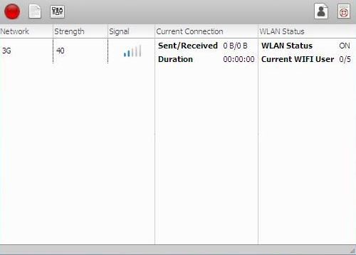

Evo: GUI application for PTCL Evo Wingle
========================================

Evo is a GUI application for PTCL Evo Wingle. Evo is a very lightweight (less than 100 KB) application
which shows network status and statistics. Evo is designed from ground up to support multi-platform and 
have hooks for future improvements.

Evo Features:
------------

* Lightweight (less then 100 KB)
* Support multi-platform. (Unix, Linux, Window, Mac)
* Beautiful theme
* Password protection support

Running:
-------

Evo has been written in Python Programming Language and its GUI is GTK based.
Therefore to run Evo, Python Interpreter and PyGi are required.

Follow the below steps, to run Evo:

1. First-of-all download Python 3 from http://www.python.org and install it.
2. Then download PyGi from https://wiki.gnome.org/Projects/PyGObject and install it.
3. After that, download Evo archive.
4. Then extract the archive and click on Evo.pyw to run it.

Documentation:
--------------

Documentation is in the doc dir.

Issues, Limitations:
--------------------

1. On clicking on the main page of Evo will result in some layout issues.
2. Evo is not draggable, when decoration set to false.
3. The project is not tested with any testing framework. So may be this version is buggy.
4. Results are not that accurate.
5. No explicit way to, check network connection.

\* Will fix these issues in second version

Future:
-------

* Metro UI
* SMS support
* Network setting support
* More network checking connection, like pinging, header request etc.
* And many more…

Freezing (Compiling):
---------------------

To freeze Evo to .exe file, you need cx_Freeze to be avilable on your pc.

Execute this:

    $ setup.py build

**Note**: You have to manually copy the *Evo.glade*, *Evo.ico* and *config.ini* files to your **build/<sub-dir>** and
replace the existing one. Because cx_Freeze don't copy these files correctly.

Licence:
--------

Copyright © 2014 Mahan Marwat. All rights reserved.
